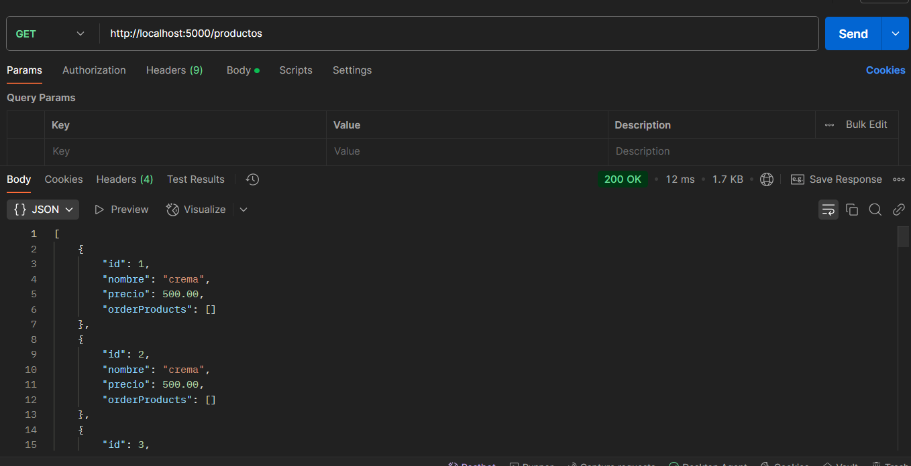
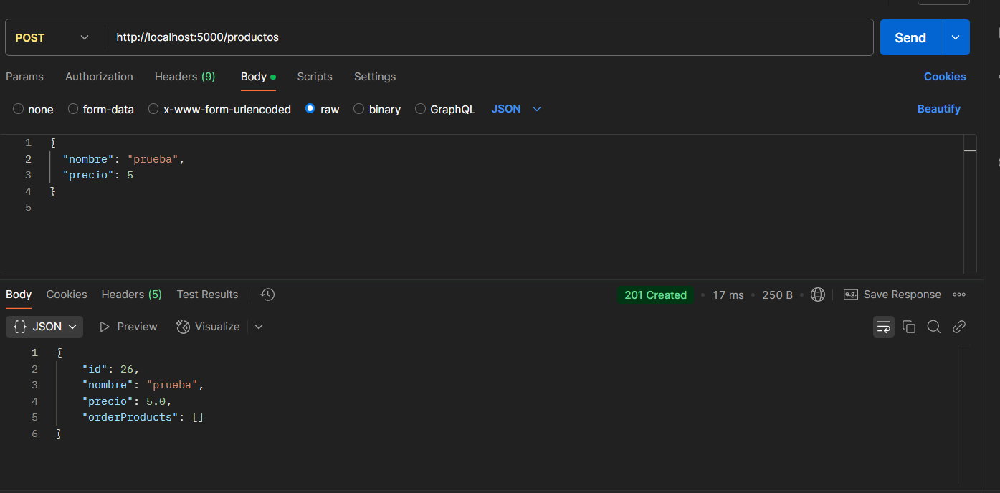
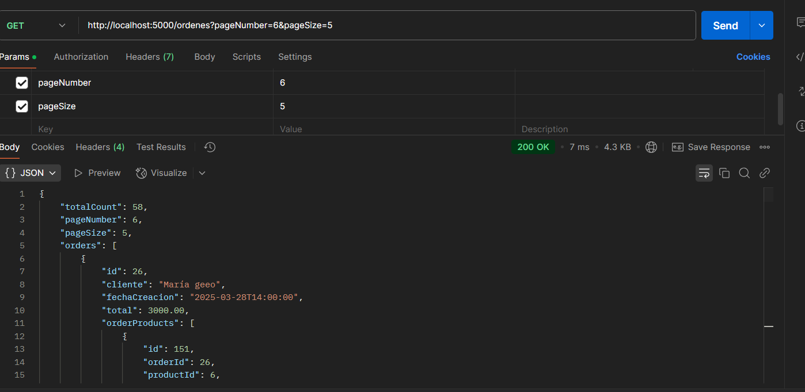
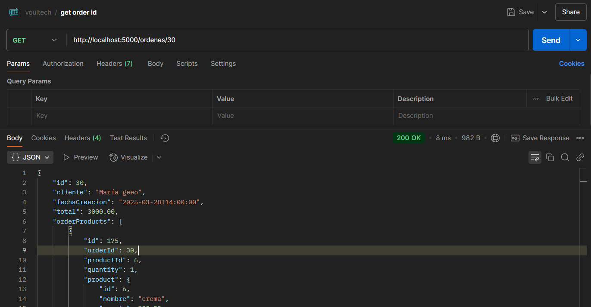
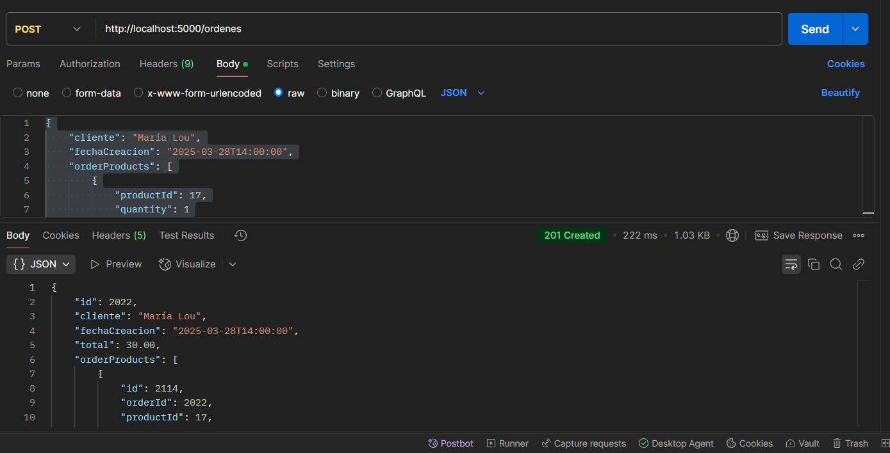
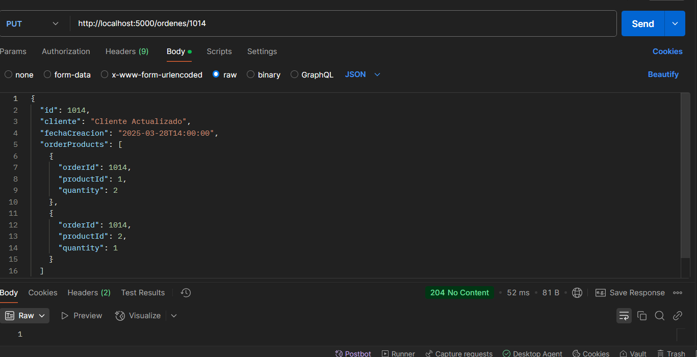
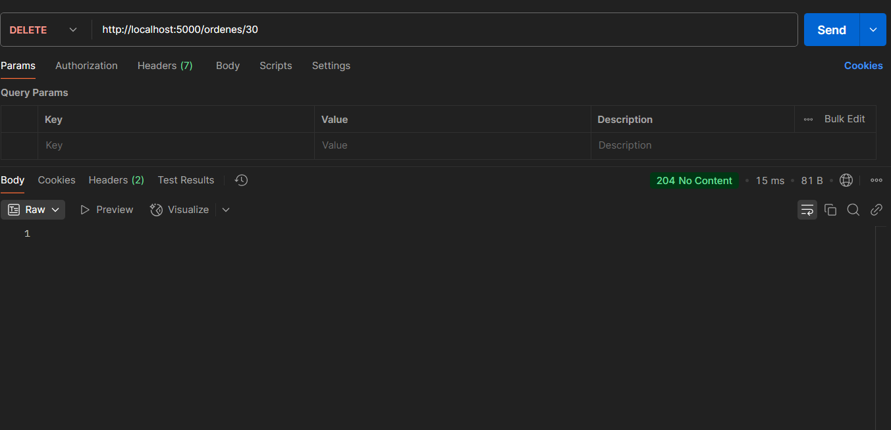

# 🚀 Cómo ejecutar 
Debes tener instalado Docker y Docker Compose. Si no lo tienes, puedes seguir la [guía de instalación de Docker](https://docs.docker.com/get-docker/).
1. 🛠️ Clona el repositorio:
```bash
git clone https://github.com/FrancoBrice/order-management-api.git
cd OrderManagementAPI
```

2. 🔑 Crea un archivo .env con esta variable:
```
SA_PASSWORD=YourStrongPassw0rd
```

3. 🐳 Ejecuta el contenedor Docker:
```bash
docker-compose up --build
```

4. 🌐 Abre en tu navegador: 
```
http://localhost:5000/swagger
```
Aquí podrás ver la documentación de la API y probar los endpoints.  Cómo ejecutar 

## Pruebas con Postman

Puedes probar los endpoints desde Postman. Aquí tienes ejemplos de cómo hacerlo:

### Productos
- GET /productos: Lista todos los productos.


- POST /productos: Crea un nuevo producto. Ejemplo:

```json
{
  "nombre": "Brownie",
  "precio": 300
}
```


### Órdenes
Antes de crear órdenes debes crear productos en la base de datos con el endpoint `POST /productos`.

- `GET /ordenes`: Obtiene todas las órdenes de compra (soporta paginación con `?pageNumber=1&pageSize=10`).


- `GET /ordenes/{id}`: Obtiene una orden específica por su ID.


- `POST /ordenes`: Crea una nueva orden. Envia un JSON como este:

```json
{
  "cliente": "Juan Pérez",
  "fechaCreacion": "2025-03-28T14:00:00",
  "orderProducts": [
    { "productId": 1, "quantity": 2 },
    { "productId": 2, "quantity": 1 }
  ]
}
```



- PUT /ordenes/{id}: Actualiza una orden existente. Debes enviar el id también en el body:

```json
{
  "id": 1001,
  "cliente": "Cliente Actualizado",
  "fechaCreacion": "2025-03-28T14:00:00",
  "orderProducts": [
    { "productId": 1, "quantity": 1 },
    { "productId": 3, "quantity": 2 }
  ]
}
```


- DELETE /ordenes/{id}: Elimina una orden por su ID.



# Ejecutar pruebas unitarias
En una terminal en la raiz del proyecto, ejecuta los siguientes comandos para compilar y ejecutar las pruebas unitarias:
```bash
dotnet build
dotnet test
```

